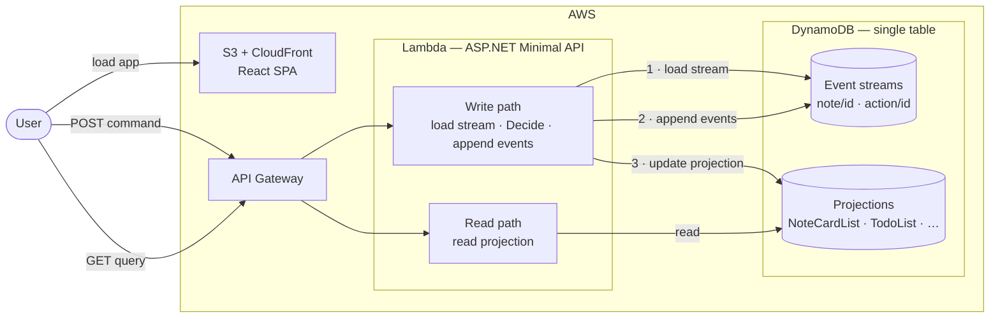

# Architecture

Detailed rationale for each decision lives in `docs/adr/`. This document is the at-a-glance picture.

## Stack

| Layer | Choice |
|---|---|
| Backend | .NET 8 on AWS Lambda (ASP.NET minimal API behind one Lambda) |
| Event store | DynamoDB + lightweight helper library |
| Frontend | React + TypeScript (Vite) |
| Infrastructure | AWS CDK in C# |
| Testing | xUnit + plain C# Given/When/Then BDD specs |
| Auth | Skipped initially — single hardcoded user. Multi-user Google Sign-In lands in the final phase. |

## Code layers

Every write request passes through three layers. Each layer has exactly one concern.

| Layer | Location | Concern |
|---|---|---|
| **API** | `src/Api/Program.cs` — endpoint lambdas | HTTP only: parse request, call handler, map result to HTTP status |
| **Command handler** | `src/Api/*CommandHandler.cs` | Orchestration: load stream → rebuild aggregate → execute command → persist events → update projection |
| **Domain** | `src/Domain/` | Pure business logic: aggregate, commands, events — no I/O, no HTTP, no clock |

**Rule:** if you find yourself writing `store.ReadAsync` or `store.AppendAsync` inside an endpoint lambda, it belongs in the command handler instead. Endpoints catch exceptions and return HTTP results; they do not orchestrate.

---

## Event sourcing

- Event store is the source of truth.
- Aggregates are pure — they accept prior events plus a command and return new events.
- Projections rebuild from the full stream; no state lives only in a projection.
- Event versioning is mandatory — once an event ships, its shape is immutable; new versions are added as new types.
- Commands are validated against the current aggregate state (rebuilt from events on demand or from a snapshot).

## BDD with event modelling

- **Event modelling** is the design artefact: prior events + command → expected new events (or error).
- BDD specs are plain C#: `Given(events).When(command).Then(expectedEvents)`.
- Specs are written before implementation. They are the success criterion for an agent slice.
- See [docs/event-model.md](event-model.md) for the living model.

## Where agents fit

- Coding agents (Claude Code primary) drive vertical slices to spec-green.
- Skills (`.claude/skills/`) replace static role prompts with reusable capabilities.
- `CLAUDE.md` provides session-level orientation; skills load on demand.
- Plan mode for design review; `/review` or a subagent for code review gating.
- Reflection captured in [docs/workflow-log.md](workflow-log.md) at the end of each phase.

## Diagram

**Write path detail:** the Lambda command handler loads the full event stream for the aggregate, folds it into current state, runs `Decide` to validate the command and produce new events, then appends those events with optimistic concurrency. The projection update happens in the same request.

**Infrastructure as code:** all AWS resources (API Gateway, Lambda, DynamoDB table, CloudFront distribution, S3 bucket) are provisioned by the CDK app in `src/Infrastructure/`.

## Cold start note

.NET on Lambda has a 1–3 second cold start by default. Mitigations (SnapStart, Native AOT) are deliberately deferred until cold start becomes a real annoyance.
