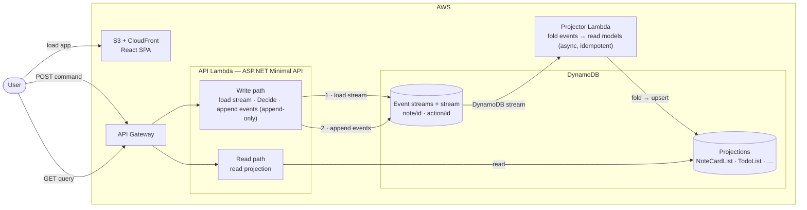

# Architecture

Detailed rationale for each decision lives in `docs/adr/`. This document is the at-a-glance picture.

## Stack

| Layer | Choice |
|---|---|
| Backend | .NET 10 on AWS Lambda (ASP.NET minimal API behind one Lambda) |
| Event store | DynamoDB + lightweight helper library |
| Frontend | React + TypeScript (Vite) |
| Infrastructure | AWS CDK in C# |
| Testing | Five layers: domain BDD specs · DynamoDB Local integration · in-process API (WebApplicationFactory) · post-deploy acceptance · CDK assertions |
| Auth | Skipped initially — single hardcoded user. Multi-user Google Sign-In lands in the final phase. |

## Code layers

Every write request passes through four layers. Each layer has exactly one concern.

| Layer | Location | Concern |
|---|---|---|
| **API** | `src/Api/Program.cs` — endpoint lambdas | HTTP only: parse request, call handler, map result to HTTP status |
| **Command handler** | `src/Api/CommandHandlers/*CommandHandler.cs` | Orchestration: load stream → rebuild aggregate → execute command → append events (**append-only** since Phase 27-C; projections are built async off the stream) |
| **Projections** | `src/Api/Projections/` (fold + projector) + `src/EventStore/Projections/` (stores) | Read models folded from the event stream by the async **Projector Lambda** off a DynamoDB stream (27-B/27-C); eventually consistent; rebuildable from the full stream |
| **Domain** | `src/Domain/` | Pure business logic: aggregate, commands, events — no I/O, no HTTP, no clock |

**Rules:**
- If you find yourself writing `store.ReadAsync` or `store.AppendAsync` inside an endpoint lambda, it belongs in the command handler instead.
- Command handlers are **append-only** (Phase 27-C). Projections are folded by the async **Projector Lambda** (`src/Projector`) off a DynamoDB stream on the event table, via the shared `ProjectionUpdater` (`src/Api/Projections/`). There is no inline projection write on the request path.
- Command handlers depend on `IEventStore` plus only the projection stores they *read* for command validation (e.g. `noteDetailStore.GetAsync` existence checks) — never to write a projection.
- Adding a new projection means adding its store + fold logic to `ProjectionUpdater` (which both the projector and a rebuild path use) — no command-handler change. See [ADR 0009](adr/0009-split-lambdas-cqrs-async-projectors.md).
- **In-process consistency:** the test harness (`ApiFactory`) and local Kestrel wrap `IEventStore` with `SyncProjectingEventStore`, which runs the *same* `StreamProjector` synchronously after each append — so in-process reads are immediately consistent while the deployed API is async. The deployed API Lambda has no decorator (gated on `AWS_LAMBDA_FUNCTION_NAME`).

---

## Event sourcing

- Event store is the source of truth.
- Aggregates are pure — they accept prior events plus a command and return new events.
- Projections rebuild from the full stream; no state lives only in a projection.
- Event versioning is mandatory — once an event ships, its shape is immutable; new versions are added as new types.
- Commands are validated against the current aggregate state (rebuilt from events on demand or from a snapshot).

## BDD with event modelling

- **Event modelling** is the design artefact: prior events + command → expected new events (or error).
- BDD specs are plain C#: `Given(events).When(command).Then(expectedEvents)`.
- Specs are written before implementation. They are the success criterion for an agent slice.
- See [docs/event-model.md](event-model.md) for the living model.

## Where agents fit

- Coding agents (Claude Code primary) drive vertical slices to spec-green.
- Skills (`.claude/skills/`) replace static role prompts with reusable capabilities.
- `CLAUDE.md` provides session-level orientation; skills load on demand.
- Plan mode for design review; `/review` or a subagent for code review gating.
- Reflection captured in [docs/workflow-log.md](workflow-log.md) at the end of each phase.

## Diagram

```mermaid
flowchart LR
    User([User])

    subgraph AWS [AWS]
        CDN["S3 + CloudFront\nReact SPA"]
        APIGW["API Gateway"]

        subgraph Lambda ["API Lambda — ASP.NET Minimal API"]
            direction TB
            WR["Write path\nload stream · Decide · append events (append-only)"]
            RD["Read path\nread projection"]
        end

        PROJ["Projector Lambda\nfold events → read models (async, idempotent)"]

        subgraph DB ["DynamoDB"]
            direction TB
            ES[("Event streams + stream\nnote/id · action/id")]
            RM[("Projections\nNoteCardList · TodoList · …")]
        end
    end

    User -- "load app" --> CDN
    User -- "POST command" --> APIGW
    User -- "GET query" --> APIGW

    APIGW --> WR
    APIGW --> RD

    WR -- "1 · load stream" --> ES
    WR -- "2 · append events" --> ES
    ES -- "DynamoDB stream" --> PROJ
    PROJ -- "fold → upsert" --> RM
    RD -- "read" --> RM
```

**Write path detail:** the API Lambda command handler loads the full event stream for the aggregate, folds it into current state, runs `Decide` to validate the command and produce new events, then appends those events with optimistic concurrency — and returns. It does **not** write projections. A **DynamoDB stream** on the event table drives the async **Projector Lambda** (`src/Projector`), which folds events into read models via the shared `ProjectionUpdater`, idempotently and replayably (a per-stream processed-position guard makes redelivery safe). **Read-after-write is therefore eventually consistent** (the projector lags the write by stream latency, typically <1s). The frontend's optimistic updates mask this for the user; server-side read-after-append callers (smoke/E2E) poll with a bounded timeout. In-process hosts (tests + local Kestrel) wrap the event store with `SyncProjectingEventStore` to run the same projector synchronously, so only the deployed system is async. Implemented across Phase 27 (27-A `ProjectionUpdater` seam → 27-B stream + projector in shadow → 27-C this cutover); see [ADR 0009](adr/0009-split-lambdas-cqrs-async-projectors.md).

**Infrastructure as code:** all AWS resources (API Gateway, Lambda, DynamoDB table, CloudFront distribution, S3 bucket) are provisioned by the CDK app in `src/Infrastructure/`.

## Frontend state management

The React frontend treats the server as eventually consistent and updates local state optimistically.

**Pattern:**
1. `App` owns the notes array — single source of truth for both `ListView` and `NoteView`.
2. On any write (create or rename), the local array is updated immediately before the API call returns.
3. On failure, the previous value is restored from a snapshot taken before the optimistic update.
4. `ListView` and `NoteView` are purely presentational — they receive data and callbacks as props, never fetch or mutate directly.

**Why not re-fetch on navigate back?**
The list re-fetches on mount. When navigating note → list, a re-fetch races with the projection update on the server — if the GET arrives before the PATCH has been committed, the old title is returned. Optimistic state sidesteps this race entirely: the title is already correct in memory when the list renders.

**E2E test implications:**
- Tests must register `WaitForResponseAsync` *before* the action that triggers the request — not after — so the listener is in place when the response arrives.
- All test data created against the real deployed environment must be uniquely named (e.g. GUID suffix) to prevent cross-run collisions in Playwright's strict-mode locators.

## Cold start note

.NET on Lambda has a 1–3 second cold start by default. Mitigations (SnapStart, Native AOT) are deliberately deferred until cold start becomes a real annoyance.
