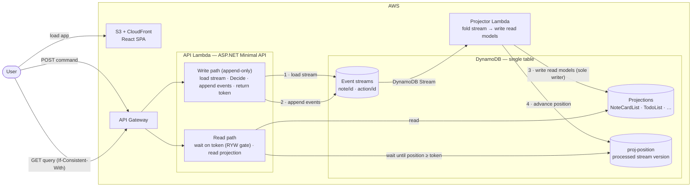

# Architecture

Detailed rationale for each decision lives in `docs/adr/`. This document is the at-a-glance picture.

## Stack

| Layer | Choice |
|---|---|
| Backend | .NET 10 on AWS Lambda (ASP.NET minimal API behind one Lambda) |
| Event store | DynamoDB + lightweight helper library |
| Frontend | React + TypeScript (Vite) |
| Infrastructure | AWS CDK in C# |
| Testing | Five layers: domain BDD specs · DynamoDB Local integration · in-process API (WebApplicationFactory) · post-deploy acceptance · CDK assertions |
| Auth | Skipped initially — single hardcoded user. Multi-user Google Sign-In lands in the final phase. |

## Code layers

Every write request passes through four layers. Each layer has exactly one concern.

| Layer | Location | Concern |
|---|---|---|
| **API** | `src/Api/Program.cs` — endpoint lambdas | HTTP only: parse request, call handler, map result to HTTP status |
| **Command handler** | `src/Api/CommandHandlers/*CommandHandler.cs` | Orchestration: load stream → rebuild aggregate → execute command → persist events → return the write token. **Append-only** — read models are built asynchronously by the projector, not the handler |
| **Projections** | `src/EventStore/Projections/` (fold logic) + `src/Api/Projections/` (projector) | Read models folded from the event stream; built **asynchronously by the projector** (the Projector Lambda off DynamoDB Streams in prod; the in-process `SyncProjectingEventStore` decorator in tests/local); rebuildable from the full stream |
| **Domain** | `src/Domain/` | Pure business logic: aggregate, commands, events — no I/O, no HTTP, no clock |

**Rules:**
- If you find yourself writing `store.ReadAsync` or `store.AppendAsync` inside an endpoint lambda, it belongs in the command handler instead.
- Command handlers are **append-only**: they persist events and return the new stream version as a read-your-writes (RYW) **consistency token** (`stream@version`). They do **not** write projections — the projector (`StreamProjector`, driven by the Projector Lambda off DynamoDB Streams in prod; the in-process `SyncProjectingEventStore` decorator in tests/local) is the **sole writer** of every read model. This async cutover landed in **[ADR 0009](adr/0009-split-lambdas-cqrs-async-projectors.md)** / Phase 27-RYW.
- Read endpoints offer **read-your-writes**: a read carrying `If-Consistent-With: stream@version` waits (bounded, ~2s) on the projector's processed-position store until the projection has caught up, then answers — else returns current data flagged `X-Consistency: stale`. See the `ConsistencyGate`.
- Command handlers depend on `IEventStore` only. Adding a new projection means adding its store + fold logic in `ProjectionUpdater`, routing its stream prefix in `StreamProjector`, giving it a rebuild path, and (if it has a read-after-write surface) gating its read on the token. **A new flow's stream prefix must join `SyncProjectingEventStore.MigratedPrefixes`** or its read models won't update in the in-process hosts.

---

## Event sourcing

- Event store is the source of truth.
- Aggregates are pure — they accept prior events plus a command and return new events.
- Projections rebuild from the full stream; no state lives only in a projection.
- Event versioning is mandatory — once an event ships, its shape is immutable; new versions are added as new types.
- Commands are validated against the current aggregate state (rebuilt from events on demand or from a snapshot).

## BDD with event modelling

- **Event modelling** is the design artefact: prior events + command → expected new events (or error).
- BDD specs are plain C#: `Given(events).When(command).Then(expectedEvents)`.
- Specs are written before implementation. They are the success criterion for an agent slice.
- See [docs/event-model.md](event-model.md) for the living model.

## Where agents fit

- Coding agents (Claude Code primary) drive vertical slices to spec-green.
- Skills (`.claude/skills/`) replace static role prompts with reusable capabilities.
- `CLAUDE.md` provides session-level orientation; skills load on demand.
- Plan mode for design review; `/review` or a subagent for code review gating.
- Reflection captured in [docs/workflow-log.md](workflow-log.md) at the end of each phase.

## Diagram

```mermaid
flowchart LR
    User([User])

    subgraph AWS [AWS]
        CDN["S3 + CloudFront\nReact SPA"]
        APIGW["API Gateway"]

        subgraph Lambda ["API Lambda — ASP.NET Minimal API"]
            direction TB
            WR["Write path (append-only)\nload stream · Decide · append events · return token"]
            RD["Read path\nwait on token (RYW gate) · read projection"]
        end

        PRJ["Projector Lambda\nfold stream → write read models"]

        subgraph DB ["DynamoDB — single table"]
            direction TB
            ES[("Event streams\nnote/id · action/id")]
            RM[("Projections\nNoteCardList · TodoList · …")]
            POS[("proj-position\nprocessed stream version")]
        end
    end

    User -- "load app" --> CDN
    User -- "POST command" --> APIGW
    User -- "GET query (If-Consistent-With)" --> APIGW

    APIGW --> WR
    APIGW --> RD

    WR -- "1 · load stream" --> ES
    WR -- "2 · append events" --> ES
    ES -- "DynamoDB Stream" --> PRJ
    PRJ -- "3 · write read models (sole writer)" --> RM
    PRJ -- "4 · advance position" --> POS
    RD -- "wait until position ≥ token" --> POS
    RD -- "read" --> RM
```

**Write path detail:** the command handler loads the full event stream for the aggregate, folds it into current state, runs `Decide` to validate the command and produce new events, then appends those events with optimistic concurrency — and stops there (**append-only**). It returns the new stream version as the RYW write token. Read models are built **asynchronously** by the Projector Lambda off the DynamoDB Stream (the sole writer), typically <1s behind. Read-after-write is preserved by a **consistency token**, not by inline projection: the write returns `stream@version`; a subsequent read presenting it in `If-Consistent-With` waits (bounded ~2s) on the `proj-position` store until the projector has caught up, then answers — otherwise returns current data flagged `X-Consistency: stale`. This is **session consistency** (cf. Cosmos session tokens / Mongo causal / Postgres `WAIT FOR LSN`), the read-after-write contract delivered by Phase 27-RYW. The next step ([ADR 0009](adr/0009-split-lambdas-cqrs-async-projectors.md) Stage 1 → 27-D) splits the single Lambda into separate Command and Query Lambdas.

**Infrastructure as code:** all AWS resources (API Gateway, Lambda, DynamoDB table, CloudFront distribution, S3 bucket) are provisioned by the CDK app in `src/Infrastructure/`.

## Frontend state management

The React frontend updates local state optimistically for **instant feel**, and relies on the server's **read-your-writes** guarantee for correctness — optimism is UI polish, not the consistency mechanism.

**Pattern:**
1. Mutations apply an optimistic cache update (TanStack Query `onMutate` → `setQueryData`), snapshot for rollback, and `onError` restore. This is purely for immediate visual feedback.
2. Every write captures the response's `X-Consistency-Token`; the matching read attaches it as `If-Consistent-With` so the server waits for the projector before answering (the api layer's `gatedRead`). On a `stale` response the read retries (bounded).
3. Correctness across a reload/navigation no longer depends on optimism: the token is persisted in `sessionStorage`, so even after a hard reload (which drops the optimistic cache) the gated server read returns the user's own write.

**Why this replaced "optimism-for-correctness":** the reverted async cutover (27-C) tried to make reactive optimistic patching carry read-after-write correctness, and it was whack-a-mole (every navigation path had to be predicted). Phase 27-RYW moved correctness to the server (consistency tokens + the gate), leaving the client free to use optimism only where it improves feel. See [the 27-C learnings](learnings/phase-27c-async-cutover-reverted.md).

**E2E test implications:**
- Tests must register `WaitForResponseAsync` *before* the action that triggers the request — not after — so the listener is in place when the response arrives.
- A read-your-writes journey **reloads first** (dropping the optimistic cache), then asserts — proving the *server* read, not the cache.
- All test data created against the real deployed environment must be uniquely named (e.g. GUID suffix) to prevent cross-run collisions in Playwright's strict-mode locators.

## Cold start note

.NET on Lambda has a 1–3 second cold start by default. Mitigations (SnapStart, Native AOT) are deliberately deferred until cold start becomes a real annoyance.
