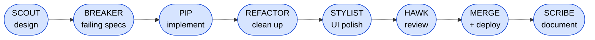
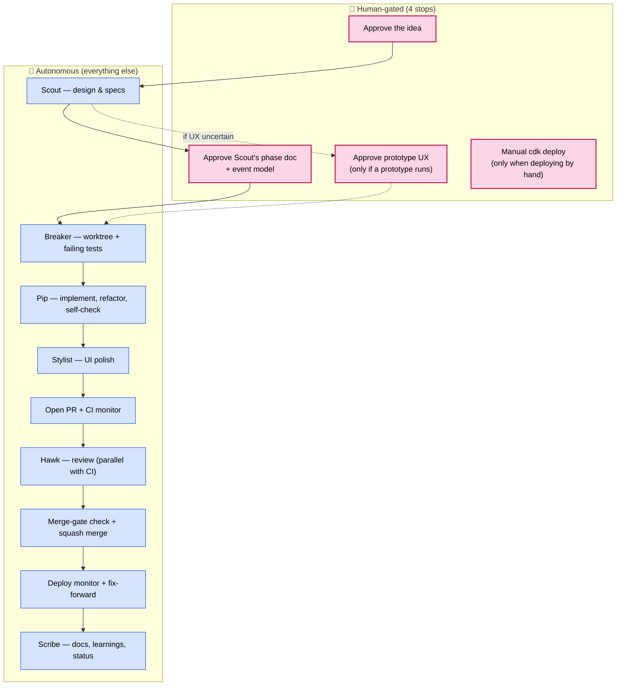
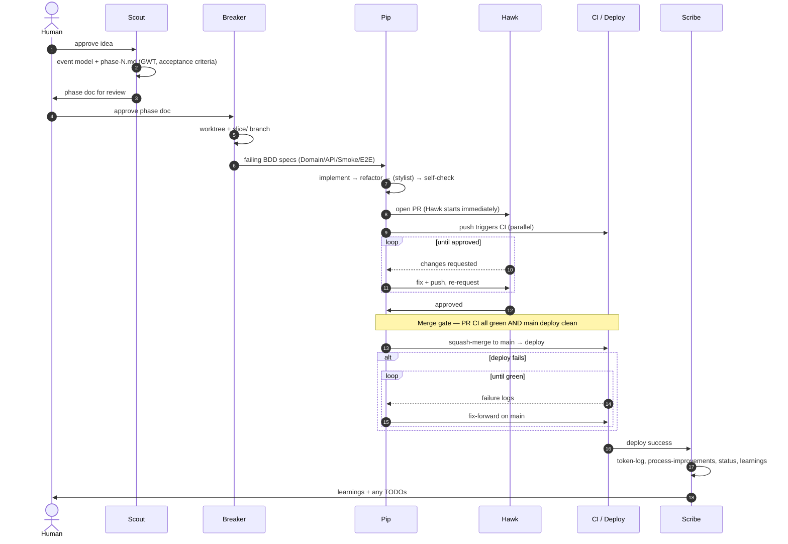

# Agentic Workflow — Diagrams

Shareable diagrams of the development pipeline used in this repo, for explaining the agentic
workflow to others. The authoritative, prose definition lives in
[`.claude/skills/.agent/generic/agent-roles.md`](../.claude/skills/.agent/generic/agent-roles.md)
and the rules in [`CLAUDE.md`](../CLAUDE.md); these diagrams are a visual summary of that.

All diagrams use [Mermaid](https://mermaid.live), which renders natively on GitHub. Paste any
block into <https://mermaid.live> to export PNG/SVG for slides.

**Pick a diagram for your audience:**

| Diagram | Best for |
| --- | --- |
| [1. Full flowchart](#1-full-flowchart) | A complete walk-through; the canonical picture |
| [2. Linear pipeline (slide-friendly)](#2-linear-pipeline-slide-friendly) | One-glance overview on a slide |
| [3. Swimlanes by trigger](#3-swimlanes-by-trigger) | Showing what's human-gated vs autonomous |
| [4. Sequence diagram](#4-sequence-diagram) | Showing hand-offs and the review/deploy loops over time |
| [5. Roles at a glance](#5-roles-at-a-glance) | A no-diagram reference table |

The cast: **Scout → Breaker → Pip → Refactor → Stylist → Hawk → Scribe**, with an optional
**Prototype** side-loop for uncertain UX.

---

## 1. Full flowchart

The complete picture: every agent, the conditional branches, and both repair loops
(Hawk⇄Pip review, deploy⇄fix). Human gates are pink; autonomous steps are everything else.

```mermaid
flowchart TD
    classDef gate fill:#ffd6e7,stroke:#c2185b,color:#000,stroke-width:2px;
    classDef agent fill:#d6e4ff,stroke:#1d4ed8,color:#000;
    classDef auto fill:#e6f4ea,stroke:#137333,color:#000;
    classDef loop fill:#fff3cd,stroke:#b8860b,color:#000;

    Idea["Loose idea / item from
future-features or technical-improvements"]:::auto
    G0{{"HUMAN GATE
Approve problem statement"}}:::gate

    Scout["SCOUT — research & design
update event-model.md
create phase-N.md + Summary table
GWT scenarios + acceptance criteria
observability-brief"]:::agent

    G1{{"HUMAN GATE
Review phase doc + event model
(skipped if already specced)"}}:::gate

    UXq{"UX novel / uncertain?"}:::auto
    Proto["PROTOTYPE (side-loop)
throwaway frontend on prototype/ branch
localStorage, no backend, no specs
iterate with user"]:::agent
    GP{{"HUMAN GATE
Approve interaction / layout"}}:::gate
    ProtoExit["Exit: write REFERENCE.md,
update phase doc on main
(code is never merged)"]:::auto

    Breaker["BREAKER — test author
git worktree add + slice/ branch
failing BDD specs: Domain / API / Smoke / E2E
push failing tests (Skip='Pip')"]:::agent

    Pip["PIP — implement
make specs green
small working commits (backend then frontend)"]:::agent
    Refactor["REFACTOR (refactor skill)
fix smells, re-run specs"]:::agent
    UIq{"User-facing slice?"}:::auto
    Stylist["STYLIST (ui-ux-pro-max)
visual polish + a11y, re-run tests"]:::agent
    SelfCheck["Pip pre-PR self-check
coverage, lint, tsc, guards"]:::auto
    PR["Open PR (gh pr create)
schedule CI monitor"]:::auto

    CI["CI checks run
(informational for Hawk timing)"]:::auto
    Hawk["HAWK — reviewer
5-axis review: correctness, readability,
architecture, security, performance
+ findings block in learnings doc"]:::agent

    Verdict{"Hawk verdict?"}:::auto
    Fix["Pip fixes findings
push then re-request Hawk"]:::loop

    Gate{{"MERGE GATE (hard, autonomous)
(a) PR CI all pass
(b) main's latest deploy completed + success,
    none in progress"}}:::gate

    Merge["Squash-merge --delete-branch
remove worktree
monitor main deploy"]:::auto
    Deploy{"Deploy result?"}:::auto
    DeployFix["Pip: read --log-failed,
diagnose, fix on main, re-run"]:::loop

    Scribe["SCRIBE — post-deploy docs
token-log + spike flags
process-improvements (apply Done now)
mark phase/roadmap status Done
write learnings/phase-NX.md"]:::agent
    Done(["Slice deployed and documented"]):::auto

    Idea --> G0 --> Scout --> G1 --> UXq
    UXq -- yes --> Proto --> GP -->|approved| ProtoExit --> Breaker
    GP -. needs changes .-> Proto
    UXq -- no (obvious CRUD) --> Breaker
    Breaker --> Pip --> Refactor --> UIq
    UIq -- yes --> Stylist --> SelfCheck
    UIq -- no --> SelfCheck
    SelfCheck --> PR
    PR --> CI
    PR --> Hawk
    Hawk --> Verdict
    Verdict -- changes requested --> Fix --> Hawk
    Verdict -- approved --> Gate
    CI -.->|must be green| Gate
    Gate --> Merge --> Deploy
    Deploy -- fail --> DeployFix --> Deploy
    Deploy -- success --> Scribe --> Done
```

**How to read it**

- **Pink diamonds = the only places work pauses.** Three are genuine human approvals
  (idea, Scout's phase doc, prototype UX). The fourth — the merge gate — is a hard stop that
  Pip clears *autonomously* by verifying CI + deploy state; it's drawn pink because nothing
  merges until it's satisfied.
- **Amber = repair loops** — Hawk⇄Pip until approved, and deploy⇄fix until green.
- **Prototype is a conditional side-loop** taken only for novel/uncertain UX. Its code is
  thrown away; only the updated phase doc survives.
- Everything not gated runs **autonomously** end to end.
- **The gates are where the approach gets agreed — after that the human is the last resort.**
  Downstream of the pink diamonds, questions go to a *peer session* (`ListAgents` →
  `SendMessage`), not to the human: whose branch is this, is this red gate mine, is that bug id
  already claimed. An item already written up in a phase doc or tracking table has *already*
  cleared its gate — starting it needs no further approval. See `CLAUDE.md` →
  `### When NOT to hand back`.

---

## 2. Linear pipeline (slide-friendly)

The happy path collapsed to one line — good for a single slide. Gates and loops are dropped
for clarity (see diagram 1 for those).

One-liner for narration:

> **Scout** designs it → **Breaker** writes failing tests → **Pip** makes them pass →
> **Refactor** cleans up → **Stylist** polishes the UI → **Hawk** reviews the PR →
> merge & deploy → **Scribe** documents and records learnings.

---

## 3. Swimlanes by trigger

Same pipeline, grouped by *what sets each step going* — useful for explaining where a human is
in the loop versus where the agents drive themselves.

> The merge gate is autonomous: Pip verifies PR CI is all-green **and** main's latest deploy is
> `completed` + `success` with none in progress, then merges without asking. The only deploy
> that needs a human is a *manual* `cdk deploy` — merge-triggered deploys run unattended.

---

## 4. Sequence diagram

Hand-offs over time, including the two loops. Good for explaining *who passes what to whom*.

---

## 5. Roles at a glance

| Step | Role | Trigger | Key output |
| --- | --- | --- | --- |
| 0 | Human | manual request | Problem statement |
| 1 | **Scout** | human approval *(gate)* | `event-model.md` + `phase-N.md` (GWT, acceptance criteria, Summary table) |
| 1.5 | **Prototype** *(optional)* | UX uncertain + human approval *(gate)* | `REFERENCE.md` + updated phase doc; code thrown away |
| 2 | **Breaker** | Scout hand-off | Worktree + `slice/` branch + failing BDD specs |
| 3a | **Pip** | Breaker's specs | Implementation; all specs green |
| 3b | **Refactor** | specs green *(auto)* | Smell-free code, specs still green |
| 3c | **Stylist** | user-facing slice *(auto)* | Polished, accessible UI |
| 3d | **Pip** | pre-PR *(auto)* | Self-check passes; PR opened + CI monitor |
| 4 | **Hawk** | PR opened *(parallel with CI)* | 5-axis verdict + findings block in learnings doc |
| 5 | **Pip** | Hawk approval *(auto)* | Merge gate verified → squash merge → worktree removed |
| 6 | **Pip** | deploy fails *(auto loop)* | Fix-forward commits until green |
| 7 | **Scribe** | deploy succeeds *(auto)* | token-log, process-improvements, status updates, learnings |

**Human gates (the only stops):** approve the idea · approve Scout's phase doc · approve a
prototype's UX · manual `cdk deploy`. Everything else is autonomous.

**Each gate agrees an *approach*, not a step.** Once the approach is written up — a phase-doc
slice, or a row in `phase-bugs.md` / `phase-minor-changes.md` /
`phase-model-prompt-improvements.md` / `technical-improvements.md` — that gate is cleared for
good and the work runs without further asking. Past the gate the human is the **last resort**:
peers answer ownership, claims, red gates and unfamiliar failures; escalate only for the
human's taste, priorities, money, or an irreversible act you would recommend.

**Branching model:** each slice runs in its own `git worktree` on a `slice/<phase>-<id>-<desc>`
branch, so independent slices can run this whole pipeline in parallel. `main` is never touched
directly during a slice.
